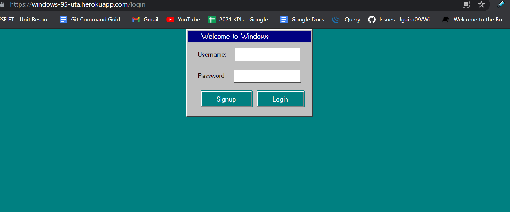

# Windows 95

[Github](https://github.com/Jguiro09/Windows-95)  
[Heroku Deployed](https://windows-95-uta.herokuapp.com/login)

 ## Screen Shots
 

## Purpose  

In the year 2021, it is difficult to find a true recreation of the early personal computer adventure.
The goal of this project is to give the user a nostalgic Windows-95 computer experience.

## Features 

Once the web browser loads the main login page, the user can either log in with his account credentials or create an account if he hasn't already. He will then be taken to the main home screen of the application, where he has the options to create a note using Notepad, or play one of the games featured on the home screen.
Once the user clicks on any of these featured apps, he will be redirected to a new window to begin playing or using the name of the program he clicked on. 

In the process of recreating Windows 95, there were some obstacles involved. One such obstacle included recreating and recovering the "X" button used to close the window, which somehow magically got lost in deployment to Heroku. This issue is still being looked into for solving and re-implementing into the program.

# Technologies Used

This project was made possible with Visual Studio Code, Git, HTML, CSS, Javascript, Windows 95 UI Kit (for fonts, sizing, colors, etc) and MySQL.

## Credits

This project was made possible thanks to the following people  
Derek Hernandez - https://github.com/HernandezDerekJ  
Jacob Guiro - https://github.com/Jguiro09  
Thomas Limmer - https://github.com/TLimmer19  
Marie Valdovinos - https://github.com/mevaldovi  
Evan Ebert - https://github.com/evan-ebert17  

